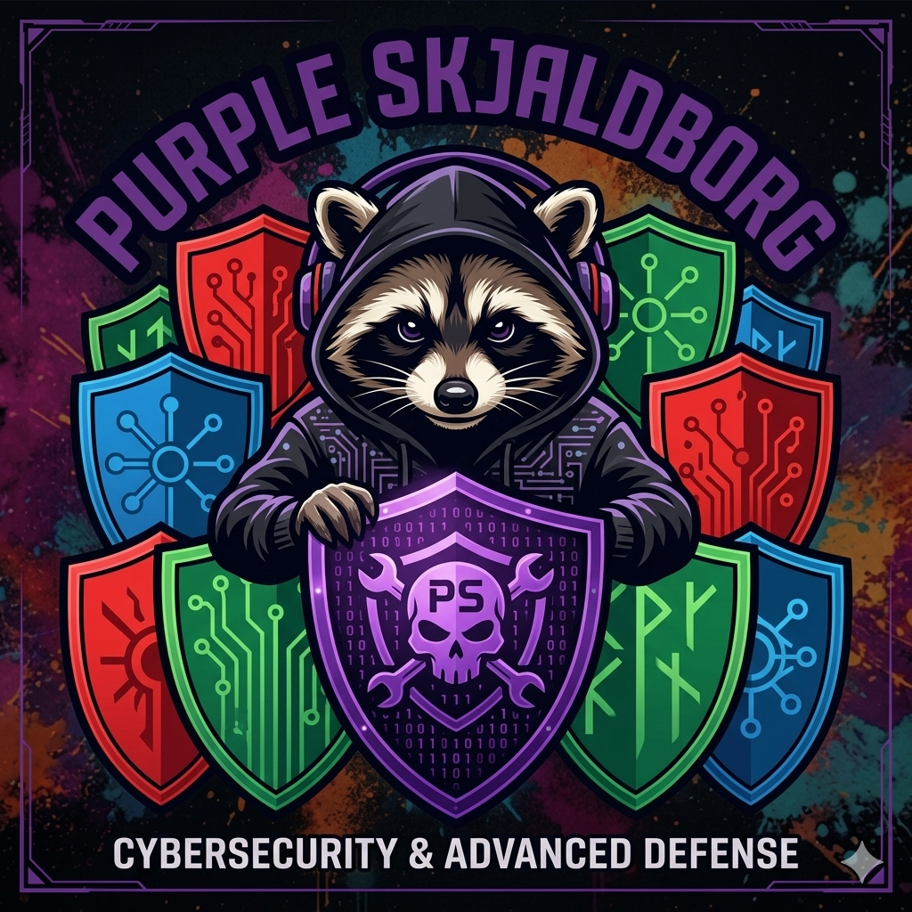
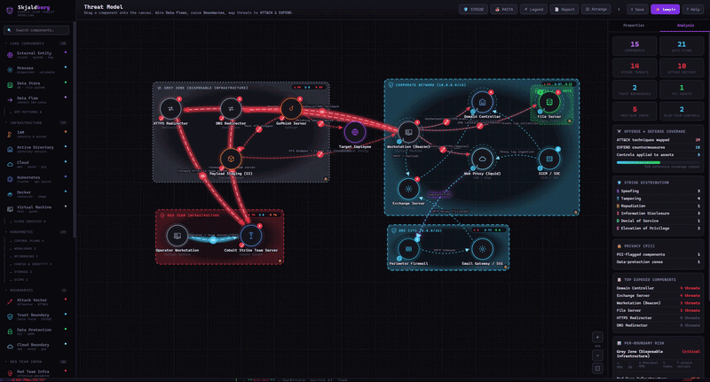

# PurpleSkjaldborg

<p align="center">
  
</p>

**Purple-team threat modeling in the browser.** Zero dependencies. One HTML file. Offense *and* defense on one canvas.

> *Skjaldborg* (Old Norse) — a **shield wall** formation where defenders interlock shields against attackers.
> This tool helps you build that digital shield wall.

---

<p align="center">
  
</p>

---

## What Is This?

PurpleSkjaldborg is a visual threat modeling tool that combines **red team attack paths** with **blue team defensive controls** in a single diagram. It integrates four industry-standard frameworks:

| Framework | Role in Skjaldborg |
|-----------|-------------------|
| **STRIDE** | Threat categorization per element (Spoofing, Tampering, Repudiation, Info Disclosure, DoS, EoP) |
| **PASTA** | 7-stage risk-centric methodology mapped to canvas constructs |
| **MITRE ATT&CK** | Adversary techniques auto-mapped to Red Team nodes and attack edges — IDs link directly to official MITRE pages |
| **MITRE D3FEND** | Defensive countermeasures auto-mapped to Blue Team shields and boundaries — IDs link directly to official MITRE pages |

---

## Quick Start

```bash
# No build. No install. Just open it.
open index.html

# Or serve locally:
python -m http.server 8765
# then navigate to http://localhost:8765
```

The app loads an **AD Attack Chain** sample by default. Click **Sample** in the toolbar to explore all 7 built-in scenarios.

---

## Features

### Red Team Arsenal

- **C2 Frameworks** — Cobalt Strike, Brute Ratel, Sliver, Havoc, ArachneC2, AdaptixC2
- **Phishing Infra** — EvilGinx2, GoPhish, Tangled, PhishingClub
- **Pivoting & Tunneling** — Ligolo-ng, Chisel, SSH tunnels, SOCKS proxies, dnscat2, iodine
- **Living off the Land** — LOLBins, LOLDrivers, file transfer utilities
- **Auto ATT&CK** — Every Red Team node ships with pre-mapped MITRE technique IDs
- **OpSec Ratings** — Each tool gets an intrinsic OpSec level (1 Loud → 5 Very Quiet), visible in the inspector and on the canvas bust% badge

### Blue Team Shields

- **EDR/XDR** — CrowdStrike Falcon, Microsoft Defender, Elastic Security, SentinelOne and 15+ more
- **NDR** — Darktrace, Vectra AI, ExtraHop, Corelight and more
- **Network Security** — pfSense/OPNsense, Suricata, Squid, WAF, NAC
- **Cloud Security** — Wiz, Prisma Cloud, CNAPP, CSPM, CASB, DLP
- **Hardening & Deception** — ASR/GPO, Kyverno, HoneyPots/Decoys

> Blue tools attach as **shields on assets** (force-ring + D3FEND coverage), not floating boxes.

### Personas & Human Actors

Model the **people** in your threat story — not just infrastructure. Persona nodes render as stick figures (not boxes) and carry human-centric properties instead of STRIDE/MITRE assessments:

- **Actor types** — Employee, IT Admin, Developer, Executive, Vendor / Contractor, plus security roles (Red Teamer, Blue Teamer) and a generic Threat Actor
- **Attacker profile** *(Threat Actor & Red Teamer only)* — alias/handle, motto/quote, **Intent** (4 CIA-impact dimensions: 🕵️ Espionage · 💥 Destructive · ⚡ Disruptive · 💰 Cyber-Crime), **Capability** level (Script Kiddie → Nation-State), motivation, sophistication, free-text **Needs** (goals) and **Obstacles** (where defenders can intervene)
- **Human risk profile** *(non-attacker personas)* — 🎣 **Social Engineering Susceptibility**, 🧠 **Security Awareness Level**, and 💸 **Fraud Exposure** (Critical → Minimal, e.g. BEC / CEO-fraud payment authority)
- **⭐ VIP / High-Value Target** flag for Executives and IT Admins — surfaces whaling / BEC priority targets, shown with a gold star badge on the node
- **🔑 MFA** toggle on auth-capable personas — auto-syncs a D3FEND `D3-MFA` mapping
- **Reworked context menu** — persona right-click menus adapt per type: intent quick-toggles for attackers; MFA, VIP, and fraud-exposure cycling for human personas; free-movement toggle for all

### Canvas & Visualization

- **Animated tunnel edges** — Red glow for offensive pivots, blue glow for defensive VPN/encrypted channels
- **Green glow on encrypted flows** — Data flows with *Encrypted in Transit* enabled pulse with a green glow and dashed overlay
- **Freehand Trust Boundary** — Click vertices on the canvas to draw any polygon; press Esc to finalize. Rendered with smooth Catmull-Rom curves, classical threat-model style
- **Rectangular boundaries** — Trust (blue), Privacy/PII (green), Cloud (gradient), Network (dashed), Red Team, Grey Zone, K8s Namespace, NetworkPolicy
- **Semantic Auto-arrange** — One click organises nodes into 10 semantic zones: External · Network/DMZ · Corporate · Kubernetes · Cloud · IAM · Blue Team · Red Team · Grey Zone · Pivot/Tunneling
- **Semantic context menus** — Right-click items adapt to the component type: PII/classification for data stores, STRIDE flags per process type, privilege flag for K8s pods, OpSec for red team, internet exposure for assets, and human-actor actions (intent, MFA, VIP, fraud exposure) for personas
- **Clickable MITRE IDs** — Every ATT&CK and D3FEND chip opens the official MITRE technique page in a new tab
- **Zoom & pan** — Scroll to zoom, drag background to pan

### Node Badges (Canvas indicators)

Each node carries up to four corner badges so you can read the threat posture at a glance without opening the inspector:

| Badge | Position | Meaning |
|-------|----------|---------|
| 🌐 Globe | Top-center | Asset is **internet-exposed** |
| Count pill | Top-right | ATT&CK / STRIDE technique count |
| 🔒 / 🛡️ | Bottom-left | PII lock · Red sword · Blue shield |
| ⚡ Ease score | Bottom-right | Ease of Attack score (0–100, color-coded) |
| % Bust ring | Bottom-right | **Red team only** — detection bust likelihood |
| Dashed ring | Outer ring | Red team detection risk color (green → red) |
| 🔑 Key | Bottom-center | **MFA** enabled on an auth-capable node |
| ⭐ Star | Top-right | **Persona only** — VIP / High-Value Target |
| 💸 Cash | Bottom-left | **Persona only** — Fraud Exposure (color-coded by severity) |

### Red Team OpSec & Detection

Every red team node gets a live **bust likelihood** score that reflects how detectable it is by the blue team on the same canvas:

- **Intrinsic OpSec level** (1–5) is assigned per tool type: LOLBins and CDN-fronted C2 are quiet (5), default Cobalt Strike profiles are loud (1–2)
- **D3FEND coverage** is computed by scanning all blue team nodes and controls on the canvas for techniques that match the red team node's detection surface
- **Bust risk** = detection coverage × OpSec dampener `[1.0, 0.82, 0.65, 0.50, 0.40]`
- Canvas shows a **color-coded dashed ring** and a **bust % badge** (bottom-right)
- Inspector panel shows the full breakdown: OpSec level pips, bust likelihood bar, detected-by list, and uncovered detection gaps

### Ease of Attack

Every non-red-team node gets an automatically computed **Ease of Attack score** (0–100):

| Score | Label | Color |
|-------|-------|-------|
| 0–19 | Very Hard | 🟢 Green |
| 20–37 | Hard | 🟡 Yellow-green |
| 38–54 | Medium | 🟡 Yellow |
| 55–71 | Easy | 🟠 Orange |
| 72–100 | Critical | 🔴 Red |

The score starts from a base value per node type and is adjusted automatically by:

- Number of attack edges pointing at the node
- Active STRIDE threat flags
- Privileged container flag
- Security controls attached
- D3FEND countermeasures mapped
- Encrypted at Rest / Encrypted in Transit flows
- ±5 manual fine-tuning buttons in the inspector

### Data Classification (Stores & Databases)

Click any data-holding node (Store, Bucket, DB, Cache, Secret, ConfigMap, Queue…) to access:

- **Classification level** — Unclassified / 🟢 Public / 🔵 Internal / 🟡 Confidential / 🟠 Restricted / 🔴 Secret
- **Data categories** — tag Personal (PII), Health (PHI), Financial (PCI), Biometric, Communications, Legal
- **🔐 Encrypted at Rest** toggle

All settings are accessible from both the inspector panel and the right-click context menu.

### Internet Exposure

Flag any asset as reachable from the public internet:

- **🌐 Globe badge** appears on the node at 12 o'clock position (blue, distinct from all other badges)
- **Inspector toggle** — `🌐 Exposed to Internet` switch on every node
- **Context menu** — `Mark as internet-exposed` / `Remove internet exposure` for all non-red-team, non-blue-team nodes
- The built-in scenarios pre-annotate the correct nodes (firewalls, VPN gateways, email gateways, reverse proxies, phishing infra, cloud APIs, CI/CD platforms, ingress controllers…)

### Multi-Factor Authentication (MFA)

Flag MFA on any auth-capable asset or human persona:

- **🔑 Key badge** at the node's 6 o'clock position (emerald, non-overlapping with other badges)
- **Inspector toggle** and **context-menu** action on supported types (external, API, cloud, IAM, web app, AD, SIEM, firewall, and most personas)
- Enabling MFA **auto-maps the D3FEND `D3-MFA` countermeasure** and **lowers the Ease of Attack score**; a missing MFA on an auth-capable node raises it

### Analysis & Reporting

- **Per-boundary risk scoring** — Attack surface vs. countermeasure coverage
- **STRIDE matrix** — Visual applicability grid for all elements
- **PASTA stages** — 7-stage methodology walkthrough mapped to your diagram
- **Markdown report export** — Full threat model document including STRIDE assessment, ATT&CK/D3FEND lists, PII assets, and data classification metadata
- **SVG export** — Rich self-contained image with:
  - Node annotations (ease score, classification level, ATT&CK count, STRIDE flags, encryption status)
  - Right-side **Analysis Panel** with summary metrics, STRIDE bar chart, ATT&CK technique list, D3FEND coverage, data classification breakdown, red team OpSec assessment, and per-node ease breakdown
  - Embedded font, resolved CSS variables, grid removed
  - **Zoom & pan** — scroll to zoom, drag to pan, `+` / `−` / `fit` buttons
- **JSON import/export** — Save and share full models with your team

---

## Built-in Scenarios

| Scenario | Kill Chain | Key Techniques |
|----------|-----------|----------------|
| **AD Attack Chain** | Phishing → LOLBins → Ligolo-ng pivot → Kerberoasting → ADCS abuse | DCSync, Golden Ticket, EvilGinx2 AiTM, WireGuard VPN |
| **Cobalt Strike Beacon Drop** | GoPhish campaign → Macro payload → Beacon C2 → Lateral movement | Malleable C2, DNS fallback, Kerberoasting, HTTPS egress |
| **K8s Cluster Compromise** | RCE in pod → SA token theft → etcd dump → Cloud exfil | RBAC abuse, container escape, IRSA pivot, supply chain |
| **Cloud Identity Breach (Azure)** | Consent phishing → OAuth token → Graph API → Key Vault | Entra ID takeover, MFA bypass, Managed Identity abuse |
| **Supply Chain Attack (CI/CD)** | Malicious NPM dep → Runner RCE → Backdoored image → Prod | IRSA credential theft, ECR poisoning, ArgoCD deploy |
| **Ransomware (Double Extortion)** | RDP brute-force → Cobalt Strike → DCSync → Exfil → GPO deploy | BYOVD EDR kill, rclone exfil, VSS/Veeam deletion |
| **Phishing & CEO Fraud (BEC)** | OSINT → lookalike domain → spoofed "CEO" email → AP clerk → fraudulent wire → mule account | Impersonation (T1656), Financial Theft (T1657), DMARC/SPF bypass — *malware-free, human-centric* |

All scenarios are pre-annotated with internet-exposed assets, STRIDE flags, ATT&CK/D3FEND techniques, PII zones, and security controls. The **CEO Fraud** scenario showcases the persona system — human actors with fraud exposure, social-engineering susceptibility, awareness levels, and a VIP-flagged executive.

---

## Keyboard Shortcuts & Interactions

| Action | Result |
|--------|--------|
| `?` | Open Help panel |
| `Esc` | Stop drawing flows · finalize freehand boundary · cancel tool · deselect |
| `Shift` + click | Keep node/boundary tool armed (place multiple) |
| `Delete` / `Backspace` | Delete selected element |
| `F2` | Rename selected element |
| Double-click edge | Toggle attack vector ↔ data flow |
| Right-click anything | Semantic context menu |
| Scroll | Zoom |
| Drag background | Pan |
| Click flow tool → source → target | Draw edge; tool stays armed — keep wiring or press Esc |
| Click Freehand Boundary → vertices → Esc | Draw and save a polygon trust boundary |
| Click MITRE ID chip | Open official MITRE technique page in new tab |

---

## Architecture

```
index.html (single file)
├── <style>       — CSS: dark theme, animations, modal/overlay, help panel
├── <body>        — HTML: toolbar, palette, SVG canvas, inspector, overlays
└── <script>      — JS: state, rendering, interactions, samples
    ├── COMPONENTS[]              — Node type definitions (icon, role, ATT&CK/D3FEND defaults)
    ├── BND{}                     — Boundary visual config (color, dash, animation, MITRE mapping)
    ├── STRIDE / PASTA            — Framework data structures + per-type applicability
    ├── CLASSIFICATION_LEVELS / DATA_CATEGORIES — Data classification metadata
    ├── OPSEC_RATINGS             — Per-tool intrinsic OpSec levels (1–5)
    ├── BASE_EASE / computeEaseOfAttack() — Ease of Attack scoring engine
    ├── computeRedTeamDetection() — Bust risk: D3FEND coverage × OpSec dampener
    ├── Render pipeline           — SVG: boundaries → edges → nodes (layered)
    ├── Freehand polygon          — Catmull-Rom → cubic Bézier smooth open path
    ├── Auto-arrange              — 10 semantic zone layout
    ├── SVG export                — Canvas clone + node annotations + analysis panel + zoom script
    ├── Interaction               — Drag, select, arm tools, context menus, continuous flow drawing
    ├── Persona system            — Human-actor nodes (stick figures), intent/capability, fraud exposure, VIP, MFA
    ├── Sample library            — 7 pre-built scenarios with spatial layout and internet exposure flags
    └── Help system               — Full-screen tabbed help (Tutorial / Metamodels / Workflow / Shortcuts / About)
```

**Zero dependencies.** No React, no D3, no build step. Opens in any modern browser, works offline.

---

## Philosophy

Most threat modeling tools make you choose: either you model the attacker *or* you model the defenses. PurpleSkjaldborg lets you do both on the same canvas because **purple teams need both perspectives simultaneously**.

- Attack paths and defenses rendered together expose gaps visually
- Residual risk scoring quantifies where you're under-defended
- Auto-mapped ATT&CK/D3FEND means you don't need encyclopedic MITRE knowledge
- OpSec ratings and bust likelihood make red team detectability tangible
- Ease of Attack scores give defenders a prioritized target list
- Data classification surfaces which stores are highest-value targets
- Internet exposure flags make the attack surface boundary explicit
- Personas put the **human attack surface** on the canvas — social engineering, fraud exposure, and awareness alongside the technical kill chain
- Sample kill chains let you start from realistic scenarios and adapt

---

## Further Reading

- [Threat Modeling — Culture & Practice](https://benjitrapp.github.io/cultures/2022-06-11-threat-modeling/) — Foundational concepts on STRIDE, PASTA, and integrating threat modeling into engineering workflows
- [MITRE ATT&CK](https://attack.mitre.org/) — Adversary tactics & techniques knowledge base
- [MITRE D3FEND](https://d3fend.mitre.org/) — Defensive countermeasure taxonomy
- [Incident Response Playbooks](https://github.com/BenjiTrapp/incident-response-playbooks) — Companion IR visualization project

---

## License

MIT

---

<p align="center">
  <b>PurpleSkjaldborg</b> — Build your digital shield wall.<br>
  <sub>Purple-Team Threat Modeling &middot; STRIDE &middot; PASTA &middot; ATT&CK &middot; D3FEND &middot; Personas &middot; OpSec &middot; Ease of Attack</sub>
</p>
